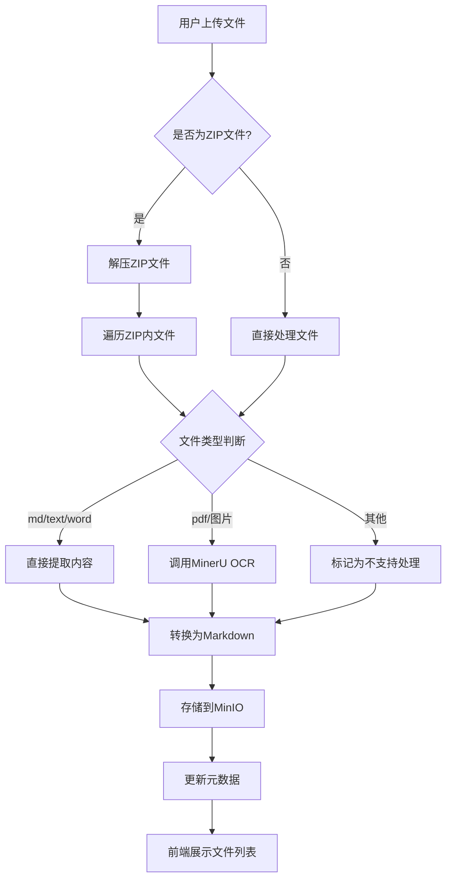

# 更新版文件内容提取功能说明文档

## 概述

本文档详细介绍了更新版的文件内容提取功能。该功能在知识库上下文中提供了增强的文件处理能力，主要改进包括：

1. ZIP文件上传后立即解压，系统直接展示其中的所有文件，而非展示ZIP包本身
2. 根据文件类型自动选择处理方式：
   - md/text/word文件直接提取内容转换为Markdown
   - pdf/图片文件调用MinerU API进行OCR识别
3. 提供单个文件内容提取接口，支持前端按需处理文件

## 功能特性

### 1. 智能文件上传与处理
- 所有上传文件均存储到MinIO对象存储中
- 支持多种文件格式：PDF、图片、文档、ZIP等
- ZIP文件上传后自动解压，不展示ZIP包本身
- 根据文件类型自动选择最优处理方式

### 2. 差异化内容处理策略
#### 直接提取类型文件
- Markdown文件（.md）：直接读取内容
- 文本文件（.txt）：读取内容并包装为Markdown格式
- Word文档（.doc/.docx）：提取文本内容并包装为Markdown格式

#### OCR处理类型文件
- PDF文件（.pdf）：调用MinerU进行OCR识别
- 图片文件（.jpg/.jpeg/.png/.bmp/.tiff/.tif）：调用MinerU进行OCR识别

### 3. 单文件内容提取接口
- 提供独立的API接口用于处理单个文件
- 支持强制重新处理功能
- 处理结果自动存储到MinIO并更新元数据

### 4. 内容预览与下载
- 提供处理前后内容对比视图
- 支持原始文件和处理后Markdown内容的下载

## API接口说明

### 文件上传与自动处理接口
```
POST /api/knowledge-new-updated/databases/{db_id}/files/upload-and-extract
```
上传文件到指定知识库，系统根据文件类型自动进行内容提取处理。

### 获取文件列表
```
GET /api/knowledge-new-updated/databases/{db_id}/files
```
获取指定知识库中的所有处理后文件列表（不包含ZIP包本身）。

### 单文件内容提取接口
```
POST /api/knowledge-new-updated/databases/{db_id}/files/{content_hash}/extract-content
```
对单个文件进行内容提取处理，支持强制重新处理参数。

### 获取处理后内容
```
GET /api/knowledge-new-updated/databases/{db_id}/files/{content_hash}/processed-content
```
获取文件处理后的Markdown内容。

## 前端组件使用

### KnowledgeBaseFileExtractor组件
该组件提供了完整的文件内容提取界面，包括：
- 文件拖拽上传区域（支持ZIP自动解压）
- 文件列表展示（仅展示解压后的文件）
- 单文件内容提取按钮
- 处理前后内容对比预览

使用方法：
```vue
<template>
  <KnowledgeBaseFileExtractor :databaseId="currentDbId" />
</template>

<script setup>
import KnowledgeBaseFileExtractor from '@/views/KnowledgeBaseFileExtractor.vue'
import { ref } from 'vue'

const currentDbId = ref('your-database-id')
</script>
```

## 技术实现细节

### 处理流程



### 存储策略
1. 每个知识库对应一个MinIO存储桶：`ref-{db_id}`（其中db_id中的下划线替换为连字符）
2. 文件命名规范：
   - 原始文件：`{original_name}_{hash}.{ext}`
   - 处理后文件：`{original_name}_{hash}_processed.md`
   - ZIP中提取的文件：`{zip_name}/{file_name}_{hash}.{ext}`

### 安全措施
1. 文件类型验证
2. ZIP文件路径遍历攻击防护
3. 文件大小限制（继承项目现有策略）

### 性能优化
1. 异步文件处理避免阻塞
2. 处理结果缓存避免重复处理
3. MinIO存储优化访问速度

## 部署要求

### 环境变量
```
MINIO_URI=http://localhost:9000
MINIO_ACCESS_KEY=minioadmin
MINIO_SECRET_KEY=minioadmin
MINERU_OCR_URI=http://mineru:30001
```

### 服务依赖
1. MinIO服务正常运行
2. MinerU服务可用（本地或云服务）
3. 知识库相关服务正常

## 使用示例

### 上传并处理ZIP文件
当用户上传一个包含多个文件的ZIP包时，系统会：
1. 接收并存储ZIP文件到MinIO
2. 立即解压ZIP文件
3. 遍历其中的每个文件
4. 根据文件类型选择处理方式：
   - 文档文件直接提取文本内容
   - PDF/图片文件调用MinerU OCR
5. 将处理结果存储到MinIO
6. 在前端只展示解压后的文件列表，不显示原始ZIP包

### 单文件处理
用户可以对任意未处理或需要重新处理的文件：
1. 点击"提取内容"按钮
2. 系统根据文件类型选择处理方式
3. 处理完成后更新文件状态
4. 用户可随时预览处理结果