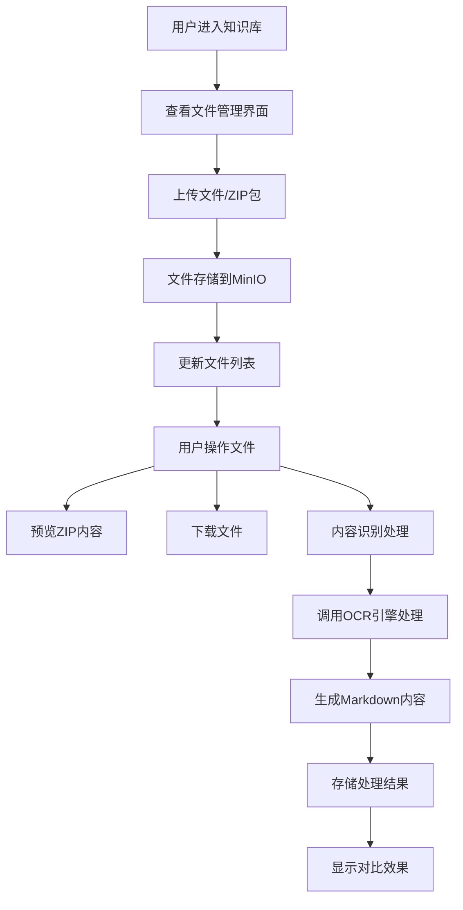

# 新增文件管理功能说明文档

## 概述

本文档详细介绍了新增的文件管理功能，该功能在知识库上下文中提供了完整的文件上传、存储、预览、处理和对比展示能力。特别地，该功能增强了对ZIP文件的支持，将ZIP包视为批量上传的文件集合。

## 功能特性

### 1. 文件上传与存储
- 所有上传文件均存储到MinIO对象存储中
- 支持多种文件格式：PDF、图片、ZIP等
- 自动进行文件名去重和安全检查
- 为每个知识库创建独立的存储桶

### 2. ZIP文件特殊处理
- 上传ZIP文件后自动解析其中的文件列表
- 将ZIP内文件以层级结构展示在文件列表中
- 支持展开查看ZIP包内所有文件
- 对ZIP内文件进行安全路径检查，防止路径遍历攻击

### 3. 文件预览与下载
- 支持在线预览PDF和图片文件
- 提供一键下载功能
- ZIP文件可查看其内部文件结构

### 4. 内容识别处理
- 对PDF和图片文件调用OCR引擎（如MinerU）进行内容提取
- 将提取内容转换为Markdown格式存储
- ZIP文件整体处理，提取其中的文本内容和图片

### 5. 内容对比展示
- 提供处理前后内容对比视图
- 左侧展示原始文件，右侧展示处理后的Markdown内容
- 支持下载原始文件和处理后的Markdown文件

## API接口说明

### 文件上传接口
```
POST /api/knowledge-new/databases/{db_id}/files/upload-with-preview
```
上传文件到指定知识库，并存储到MinIO。

### 获取文件列表
```
GET /api/knowledge-new/databases/{db_id}/files
```
获取指定知识库中的所有上传文件列表。

### 获取ZIP内容
```
GET /api/knowledge-new/databases/{db_id}/files/{content_hash}/zip-content
```
获取ZIP文件的内容列表。

### 获取ZIP子文件
```
GET /api/knowledge-new/databases/{db_id}/files/{content_hash}/children
```
获取ZIP文件中的子文件列表。

### 处理文件内容
```
POST /api/knowledge-new/databases/{db_id}/files/{content_hash}/process
```
对文件进行OCR处理并提取为Markdown格式。

### 获取处理后内容
```
GET /api/knowledge-new/databases/{db_id}/files/{content_hash}/processed-content
```
获取文件处理后的Markdown内容。

## 前端组件使用

### KnowledgeBaseFileManager组件
该组件提供了完整的文件管理界面，包括：
- 文件拖拽上传区域
- 文件列表展示（支持ZIP展开）
- 文件预览和下载功能
- 内容识别处理按钮
- 处理前后对比视图

使用方法：
```vue
<template>
  <KnowledgeBaseFileManager :databaseId="currentDbId" />
</template>

<script setup>
import KnowledgeBaseFileManager from '@/views/KnowledgeBaseFileManager.vue'
import { ref } from 'vue'

const currentDbId = ref('your-database-id')
</script>
```

## 技术实现细节

### 存储策略
1. 每个知识库对应一个MinIO存储桶：`ref-{db_id}`（其中db_id中的下划线替换为连字符）
2. 文件命名规范：
   - 原始文件：`{original_name}_{hash}.{ext}`
   - 处理后文件：`{original_name}_{hash}_processed.md`
   - ZIP中提取的图片：`{db_id}/{file_hash}/images/{image_name}.{ext}`

### 安全措施
1. 文件类型验证
2. ZIP文件路径遍历攻击防护
3. 文件大小限制（继承项目现有策略）

### 性能优化
1. 异步文件处理避免阻塞
2. ZIP子文件列表按需加载
3. 结果缓存避免重复请求

## 部署要求

### 环境变量
```
MINIO_URI=http://localhost:9000
MINIO_ACCESS_KEY=minioadmin
MINIO_SECRET_KEY=minioadmin
MINERU_OCR_URI=http://mineru:30001
```

### 服务依赖
1. MinIO服务正常运行
2. MinerU服务可用（本地或云服务）
3. 知识库相关服务正常

## 使用流程

